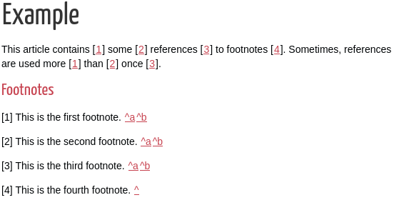

# pelican_footnote_linker

This is a [Pelican](https://github.com/getpelican/pelican/) plug-in that
generates links between in-text references footnotes.

To use:

1. Add some reference in the article in the form of `[ref#]`.

2. Add a heading that begins with the word "Footnotes". (This plug-in will look
   for h2, h3, and h4 elements that begin with the word "Footnotes".)

3. Add footnotes below the footnotes heading that begin with `[ref#]`.

Example:

```
This article contains [ref1] some [ref2] references [ref3] to footnotes [ref4].
Sometimes, references are used more [ref1] than [ref2] once [ref3].

Footnotes
---------

[ref1] This is the first footnote.

[ref2] This is the second footnote.

[ref3] This is the third footnote.

[ref4] This is the fourth footnote.
```

Generates:


